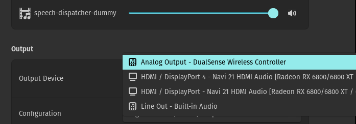
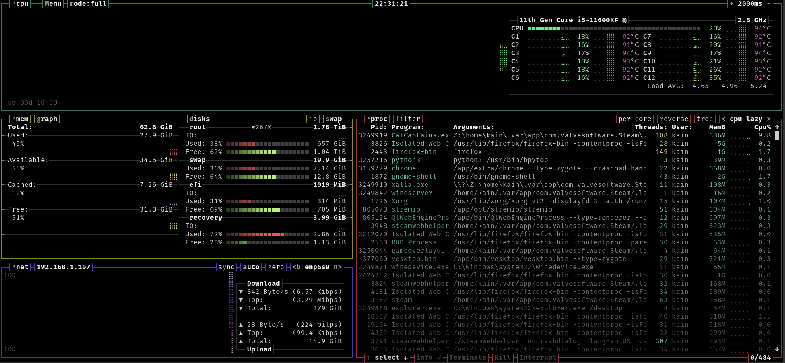
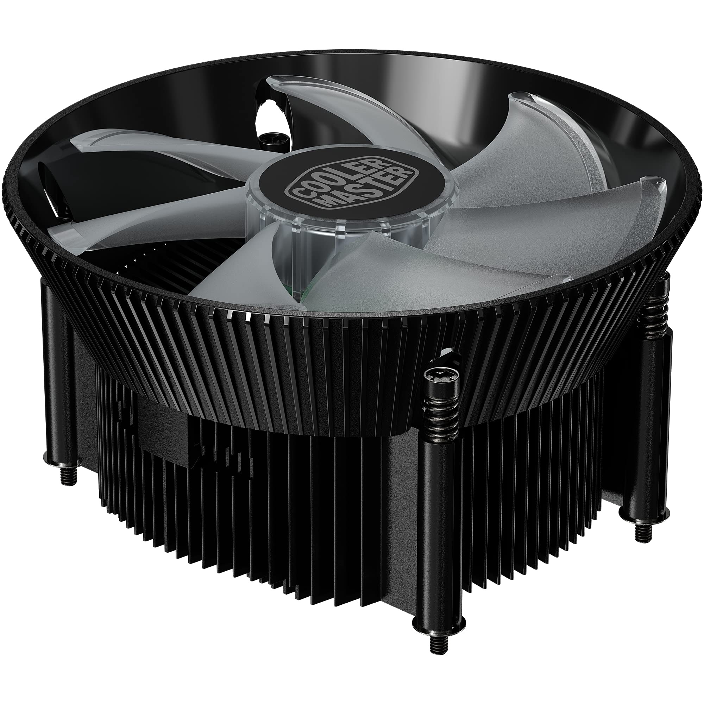
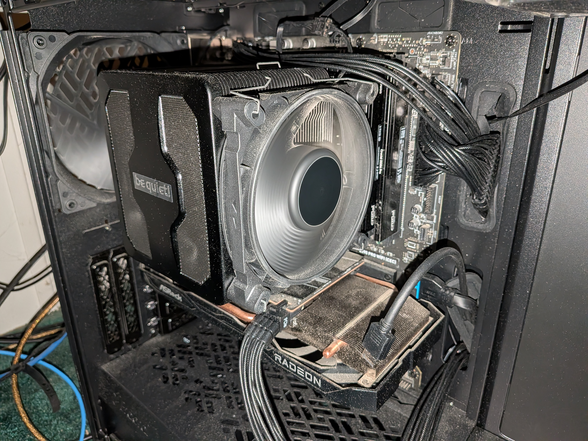
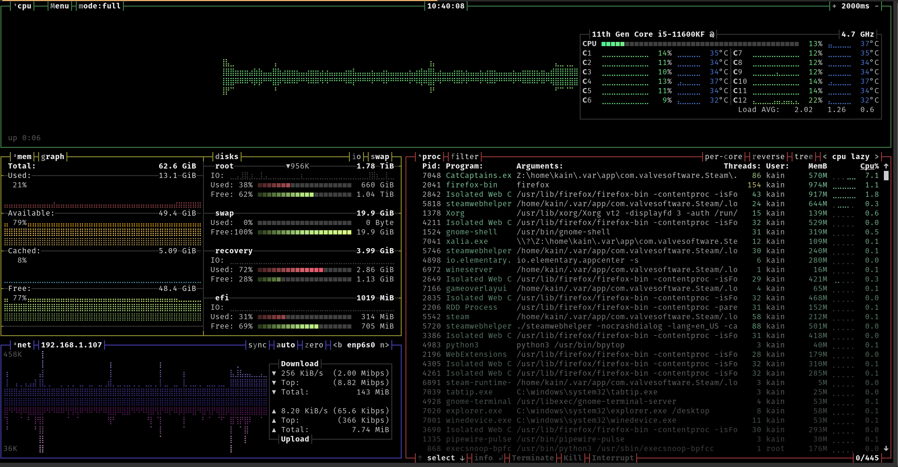
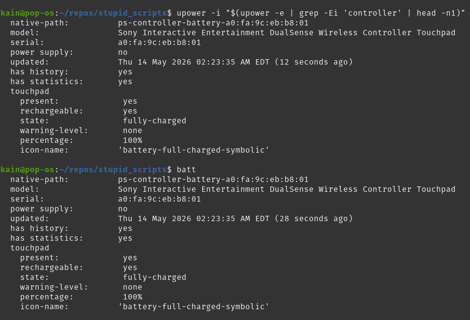

# stupid_scripts

Personal Linux helper scripts, shell config, and desktop glue.

This repo exists so my useful little Linux scripts are not scattered across `~/bin`, `~/.local/bin`, random GNOME settings, and whatever other nonsense I did at 2 AM.

It is basically a tiny recovery kit for my desktop workflow. Well, portions of my desktop workflow. Portions that are unique to my Pop!_OS install. And that's important sometimes.

## Purpose

This is the source of truth for small local scripts I actually use.

Runtime commands should live in:

```text
~/.local/bin
```

But the real editable files live in this repo:

```bash
~/repos/stupid_scripts
```

Most/all things in ~/.local/bin should be symlinks back into this repo.

## QUIC restore

Fresh Linux install, SSD died, or I did something brave and stupid:

```bash
mkdir -p ~/repos
cd ~/repos
git clone git@github.com:kain2749/stupid_scripts.git
cd stupid_scripts
./install.sh
source ~/.bashrc
```
ha, see what i did there with quic

Then verify:

```bash
command -v toggle-audio
command -v gnome-status-line
ls -l ~/.bash_aliases
```


## Layout

```text
stupid_scripts/
├── bin/
│   ├── toggle-audio
│   └── gnome-status-line
├── shell/
│   └── bash_aliases
├── install.sh
└── README.md
```

## Scripts

### `toggle-audio`

Toggles my desktop audio output. So, I have a Fire TV as my secondary monitor that I use as audio. However, I also have a portable AC unit in this room. When the portable AC unit comes on, it can drown out some of the audio that I have on. So, I can then switch to headphones. However, once the temperature in the room has been cooled, the unit cuts itself off. At this point, it is safe to change my audio back to my TV and remove the headphones. Until 5 seconds later when the unit turns back on. I originally coded this to use the sink IDs in this command:

```bash
wpctl status
```

However, I noticed a problem with this. If your computer restarts, it can randomly decide to assign sink IDs to any audio devices it wants. That was inconvenient for my use case. So I used to a different strategy in this version, where I looked at the very specific name the device was assigned by PipeWire. As I write this, 52 is the sink ID for my TV, 51 is the sink ID if I wanted all of my audio to come out of my PS5 controller, and 46 would be for my headphones.



This is likely to change when I restart my computer, which is as infrequently as possible. To handle this, I gave the HEADPHONES and TV variables names and made them all upper case so they're constants and not variables, because thems the rules. Then, I set a hotkey to ctrl+*, specifically the asterisk on the numpad, because I also use the + and - keys there to change volume. Like, with others keys pressed, not just by themselves like some kind of savage.

Current use case:

- switch between headphones and TV / HDMI audio
- triggered from a GNOME custom keyboard shortcut
- lives at a stable runtime path:

```text
/home/kain/.local/bin/toggle-audio
```

The actual source file is:

```text
~/repos/stupid_scripts/bin/toggle-audio
```

### `gnome-status-line`

Generates a compact desktop status line for GNOME / Executor.

Current idea:

```text
CPU 52° | GPU 39° | VRAM 6.5G | RAM 20G | SSD 1.2T | 🎮95% | 📱95%
```


So, I made the switch from Windows 10 to Linux a couple of years ago. When I did, I learned about this really neat and colorful CLI tool called [bpytop](https://github.com/aristocratos/bpytop). I tested it on my computer and discovered that my processor was trying to catch on fire.



I didn't take pictures of the entire process, but I was able to locate a picture of the CPU cooler that came on my prebuilt CyberPowerPC. If I correctly identified it on the invoice, it was part number FA-106-148, COOLERMASTER I71C CPU AIR COOLER ANODIZED BLACK ALUMINUM + COPPER CORE 120MM ARGB MASTER FAN INTEL, and was listed as an $18 line item expense. Below is the closest picture I was able to find online after Googling the part.



So, 4 years after buying the computer, I replaced the CPU cooler with one an acquaintance recommended to me. I didn't realize that I was ordering an engine that mounted on top of a tiny chip, but here we are. It is called the [Dark Rock Pro 5](https://www.bequiet.com/en/cpucooler/4466) if you're interested. I don't know how portable CPU coolers are from machine to machine, but I've been told this one is, so okay. Below is what it looks like in my computer, and a bpytop image of the difference it made:





I notice my GPU doesn't use fans very often. It stays pretty chill. I get worried about it, so I included it in my status line.

For questions regarding why VRAM is included, I direct you to my chess related tool: [https://github.com/kain2749/toaster_chess_analysis](https://github.com/kain2749/toaster_chess_analysis) The TLDR is that local LLMs use up a lot of VRAM, and that confused me for about an hour, and since I occasionally still use local LLMs, I decided that should be included.

Well, since now it seems like I was writing a tool to monitor all of the stuff on my computer, I went ahead and added RAM and amount of storage space remaining. Then I added how much charge is on my phone so I could use the emoji, and I thought that would be kind of neat. Anyway, that's the way too long story, below is the stuff an LLM told me to include about the code and what it does. I mean, the code was above the whole time, it's not like this was some recipe blog where I'm keeping an audience captive so you can learn to scramble the perfect egg. You read this because you decided to.

It is meant to answer the usual “what the hell is my computer doing?” questions at a glance:

- CPU temperature
- GPU temperature
- available VRAM
- available RAM
- free SSD space
- PS5 / DualSense controller battery from UPower
- phone battery from GSConnect

The runtime path is:

```text
/home/kain/.local/bin/gnome-status-line
```

The actual source file is:

```text
~/repos/stupid_scripts/bin/gnome-status-line
```

There was an emergency addition to this script after I wrote all of this, and I'm too lazy to change all of this at this moment, so perhaps later. My status bar monstrosity now includes my PS5 controller battery level.


## Shell Config

### `shell/bash_aliases`

The main Bash alias I use that matters whatsoever is the github crap and batt.



Backup/source-of-truth for my Bash aliases.

Expected live path:

```text
~/.bash_aliases
```

That should be a symlink to:

```text
~/repos/stupid_scripts/shell/bash_aliases
```

Example aliases:

```bash
alias gs='git status'
alias ga='git add'
alias gc='git commit -m'
alias gp='git push'
alias gl='git log --oneline --decorate --graph -20'
alias gd='git diff'
alias gds='git diff --staged'
alias batt='upower -i "$(upower -e | grep -Ei '\''controller'\'' | head -n1)"'
```

## Install Script

`install.sh` recreates the local symlink structure.

It should:

- create `~/.local/bin` if missing
- symlink scripts from `bin/` into `~/.local/bin`
- symlink `shell/bash_aliases` into `~/.bash_aliases`
- avoid making `~/bin` a thing again, because no

Run:

```bash
./install.sh
```

## Rules

- Edit scripts in this repo.
- Run scripts from `~/.local/bin`.
- Use symlinks, not hard links.
- Do not put secrets here.
- Do not commit SSH keys, tokens, `.env` files, or anything spicy.
- If a script grows data, generated output, or project state, it probably deserves its own repo.

## Not Here

Bigger projects stay in their own repos.

Example:

```text
~/repos/toaster_chess_analysis
```

This repo can contain convenience wrappers later, but not the whole project state.

## Why

Because rebuilding a Linux desktop from memory is annoying.

Because random scripts become infrastructure when they get hotkeyed.

Because future me will absolutely forget where the working version was.
